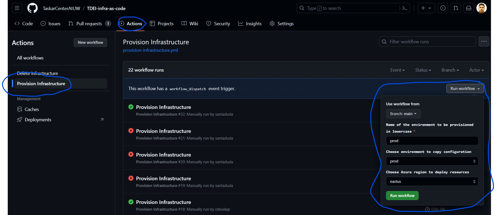

## Instructions

#### To provision PROD environment
1. Make sure that the configurations required for the prod environment are declared correct in the configuration files of each component.
   1. configuration files are located under each component name in the _infra_ folder and are named `config.json`
2. One can provision the "PROD" environment either from the `Github Actions` or from their `local machine`
3. To provision from `local machine`, follow the below instructions:
   1. Make sure that you have `python 3.10.0` installed
   2. Clone this repository to the local machine
   3. From the root directory, create a virtual environment and install the requirements 
      `py -3 -m venv .venv`  
      `.venv\Scripts\activate`  
      `.\.venv\Scripts\python.exe -m pip install --upgrade pip`  
      `pip install -r requirements.txt`
   4. Do an AZ login:  
   `az login --service-principal -u <userid> -p <password> --tenant <tenant>`  
   5. Decode the _secrets.json.enc_ by using the following command:
   `ansible-vault decrypt secrets.json.enc --output secrets.json`  
   The above will ask for a password. This is available in KeyVault secret: "ANSIVAULT_KEY"

   7. Issue the following command:  
   `py create-env.py -e <environmentName> -c <configToUse> -l <location> -s <subscription_id>`  
    Eg: `py create-env.py -e prod -c prod -l eastus -s xyz-zas-d`  

4. To provision from `Github Actions`, follow the below instructions:
   1. Make sure that you are a _maintainer_ or _administrator_ of the git repo
   2. From the _Actions_ tab, choose the `Provision Infrastructure` action
   3. Enter the parameters as below and click `Run workflow`
      1. Branch: main
      2. Environment to be provisioned: prod
      3. Environment to copy configuration: prod
      4. Choose Azure region to deploy resources: choose from the list   
             
      5. Let the workflow complete