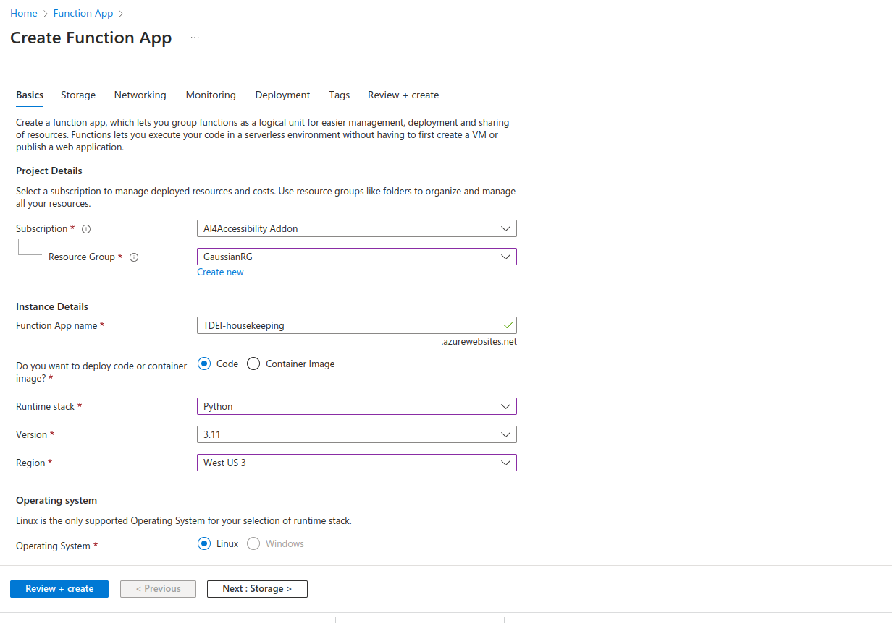

### Steps for creating azure function resources for housekeeping

**Note:** These are not automatically provisioned by IaC yet. <To-do>

1. **Sign In to Azure Portal**
   
   - Open your web browser and navigate to [https://portal.azure.com](https://portal.azure.com).
   - Sign in with your Azure account.

2. **Create a New Function App**

   - Click on "Create a resource" from the Azure Portal dashboard.
   - Search for "Function App" and select it.

3. **Configure Basics**

   - Subscription: Choose your Azure subscription.
   - Resource Group: GaussianRG
   - Function App name: TDEI-housekeeping
   - Publish: Choose "Code."
   - Runtime stack: Python 3.10
   - Region: West US 3
   - Operating System: Select "Linux."
   - Hosting: Consumption

4. **Configure Storage**
   - Select Storage account "tdeisamplestorage"
5. **Networking**
   - Enable public access
6. **Monitoring**
   - disable Application Insights 
   - click on review and create
